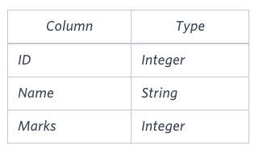

# Week 4 Practical Problems
Topic: _Basic SELECT_

## Schemas

### Problems 1-4


### Problem 5
**Students Table**



## Solutions

### Problem 1
Query all columns (attributes) for every row in the CITY table.

```sql
SELECT * FROM city;
```

### Problem 2
Query all columns for a city in CITY with the ID 1661.

```sql
SELECT * FROM city WHERE id=1661;
```

### Problem 3
Query all columns for all American cities in the CITY table with
populations larger than 100000. The CountryCode for America is USA.

```sql
SELECT * FROM city WHERE countrycode = "USA" AND population > 100000;
```

### Problem 4
Query the names of all the Japanese cities in the CITY table. The COUNTRYCODE for Japan is JPN.

```sql
SELECT name FROM city WHERE countrycode = "JPN";
```

### Problem 5
Query the Name of any student in STUDENTS who scored higher than 75 Marks.
Order your output by the last three characters of each name. If two or
more students both have names ending in the same last three characters
(i.e.: Bobby, Robby, etc.), secondary sort them by ascending ID.
```sql
SELECT name FROM students WHERE marks > 75 ORDER BY RIGHT(name, 3), id ASC;
```