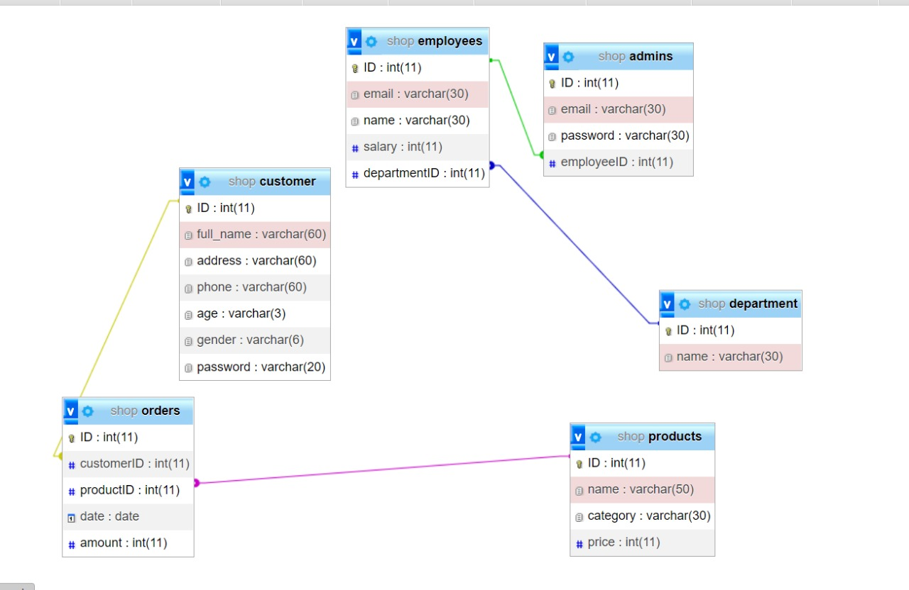

# Week 7 Practical Problems
Topic: _Implementation_

## Statement

You have this database schema, Create This Database for a small business Website

## Implementation

I used `SQLite` to implement the database.

* SQL file -> [shop.sql](./shop.sql)
* DB file -> [shop.db](./shop.db)
* SQLALCHEMY Models File -> [models.py](./models.py)